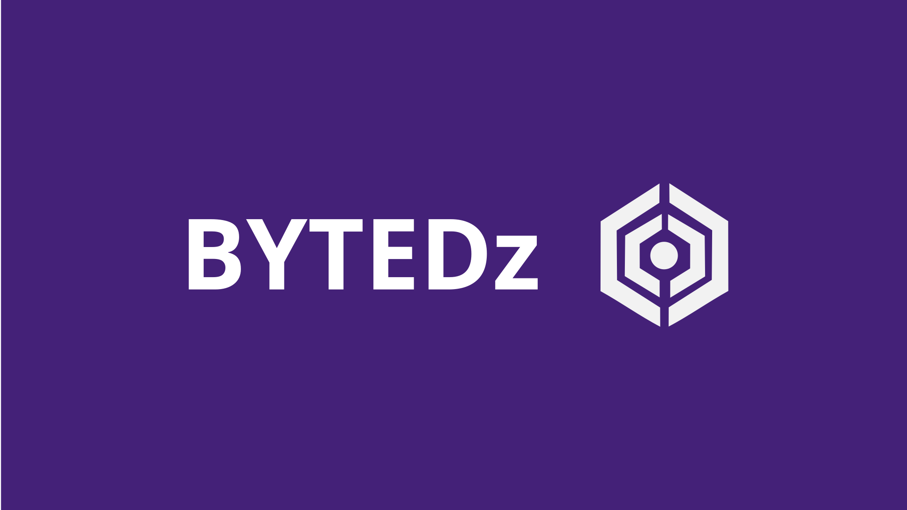

  

# Welcome to BYTEDz

BYTEDz is an open-source organization dedicated to engineering high-performance, modular utilities designed to unify desktop and mobile ecosystems. We specialize in cross-platform productivity and secure remote management solutions.

---

### Mission Statement

Our goal is to provide developers and power users with lightweight, scalable tools that prioritize security and modularity. By leveraging modern frameworks, we ensure that our software remains efficient across diverse hardware environments.

---

### Core Projects

* **[PCLink](https://github.com/bytedz/PCLink)**: A flagship remote management system engineered for secure, low-latency control of PC environments via mobile devices.
* **Modular Extensions**: A growing repository of community-driven modules designed to extend the core functionality of the BYTEDz ecosystem.

---

### Technical Infrastructure

We utilize a robust tech stack to maintain high standards of performance and maintainability:

| Category | Technologies |
| :--- | :--- |
| **Development** | Flutter, Dart, Python |
| **Backend & API** | FastAPI |
| **DevOps & CI/CD** | Docker, GitHub Actions |
| **Environments** | Linux, Cross-platform Desktop |

  

---

### Contribution and Partnership

We welcome collaboration from developers, security researchers, and contributors interested in the future of remote systems. 

* **Official Support**: [support@bytedz.com](mailto:support@bytedz.com)
* **Developer Relations**: [@Azhar_Zouhir](https://x.com/Azhar_Zouhir)
* **Software Distribution**: [Google Play Store](https://play.google.com/store/apps/dev?id=8402826415690185160)

---

  <i>Efficiency through modularity.</i>

